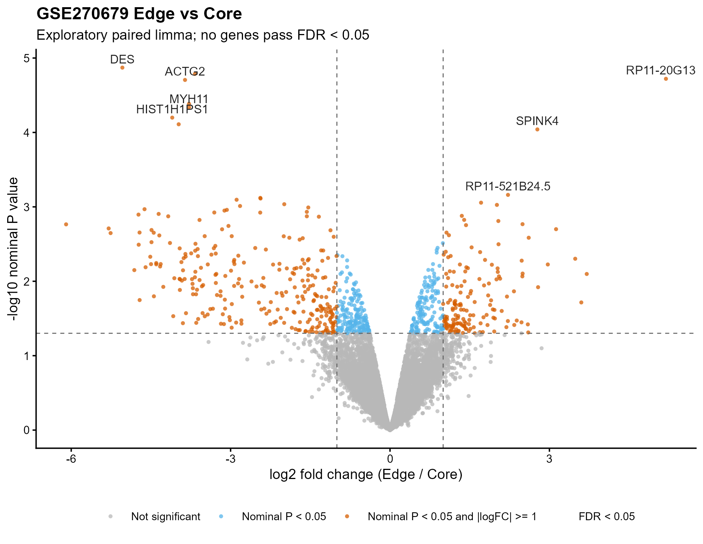
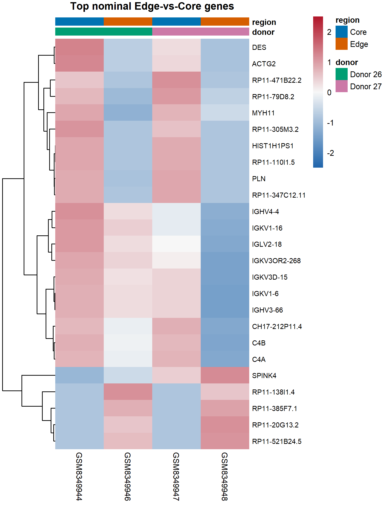
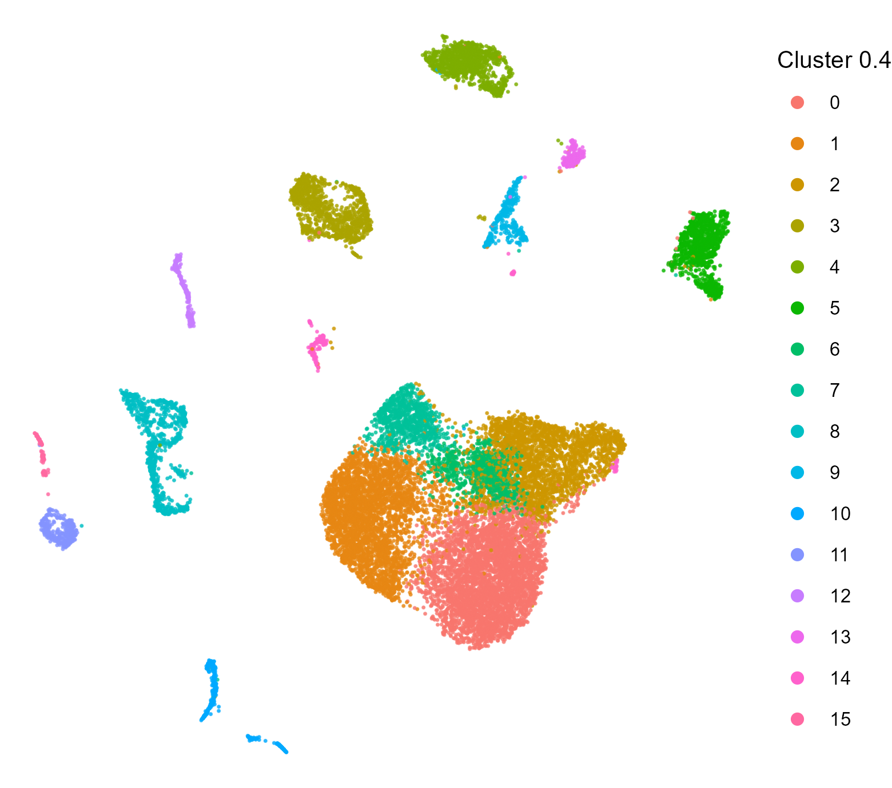
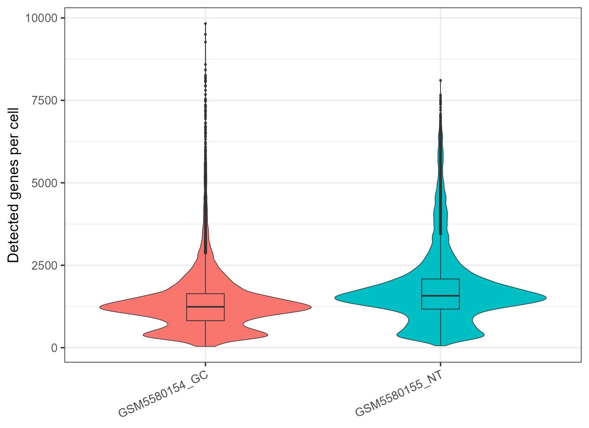

# GEO_biodata

`GEO_biodata` is a skill-first guide plus a small set of R helpers for public GEO biodata.

It helps an agent start from a GEO accession, find the right public files, download reviewed inputs, inspect their format, and choose a practical analysis route.

It is not a full R package, not a product framework, and not a replacement for established scRNA/bulk tools. Keep the repo lean: rules belong in the relevant `SKILL.md`, and R helpers exist only where they shorten a real GEO task.

## Current Release

Current public release: `v1.0.1`.

This release is fixed to the real-run hotfix line that adds resumable reviewed downloads, sample-level quantification table merging, sample-quant route review, optional `--analysis-id` output isolation, and read-only 10x MTX scRNA bundle inventory. `scale_decision.tsv` and a DE table summarizer are intentionally deferred to avoid adding a new contract or convenience layer before another real-run need.

## Choose The Narrow Skill

Use the smallest skill that matches the current task:

| Need | Skill |
|---|---|
| Decide which module to use | `geo-biodata` |
| GEO metadata, DOI/PMID/PMCID, publication supplements, file inventory, reviewed download, file-level QC, manifest draft | `geo-biodata-intake` |
| Bulk raw-count, bulk-normalized, or microarray DE/QC from a validated manifest | `geo-biodata-bulk` |
| Preranked GSEA or ORA from a mapped gene list/ranked table and local GMT file | `geo-biodata-enrichment` |
| Read-only scRNA object inventory for Seurat/H5AD/RDS/MTX | `geo-biodata-scrna` |
| Independent source-table-linked figure planning, generation guidance, and QA | `geo-biodata-figure` |
| Legacy prompts naming the old entry point | `geo-biodata-workflow` |

Stable helper scripts live under `core/R/`. The original script bundle remains under `skills/geo-biodata-workflow/scripts/` only as deprecated compatibility shims.

## Fast Download-Only Start

From the repository root:

```powershell
New-Item -ItemType Directory -Force runs\GSE000000 | Out-Null
Rscript core\R\check_environment.R runs\GSE000000\environment.tsv
Rscript core\R\bootstrap_environment.R --profile intake --check
Rscript core\R\discover_geo.R GSE000000 runs\GSE000000
Rscript core\R\generate_dataset_report.R runs\GSE000000
```

After metadata discovery and reviewed download, report the data source in the chat, not only in files. Include the GEO accession and title, DOI link, PMID/PMCID when available, 2-5 publication or dataset keywords, and one sentence explaining what the downloaded files represent. If DOI or keywords are missing locally, check GEO, NCBI/PubMed, PMC, or the publisher page and say what source was used.

Example chat summary for `GSE270679`:

```text
GSE270679: A spatially resolved atlas of gastric cancer characterises a lymphocyte aggregated region [bulk RNA-seq].
Original article DOI: https://doi.org/10.1038/s41467-026-68612-z; PMID: 41593079; PMCID: PMC12948980.
Keywords: Gastric cancer; Cancer genomics; Gene regulation in immune cells.
Downloaded inputs: 16 reviewed sample-level bulk RNA-seq quantification tables containing expected_count, TPM, and FPKM columns.
```

Review:

```text
runs/GSE000000/resources/series_metadata.tsv
runs/GSE000000/resources/sample_index.tsv
runs/GSE000000/resources/sample_characteristics.tsv
runs/GSE000000/resources/supplement_index.tsv
runs/GSE000000/resources/publication_links.tsv
runs/GSE000000/resources/publication_supplements.tsv
runs/GSE000000/resources/route_candidates.tsv
runs/GSE000000/resources/routing_evidence.tsv
```

Generate and review a selective download plan:

```powershell
Rscript core\R\generate_download_plan.R `
  runs\GSE000000 `
  "counts|matrix|expression|fpkm|tpm|h5ad|rds|mtx" `
  "candidate processed expression or metadata file"

# Edit runs\GSE000000\plans\download_plan.tsv.
# Set reviewed=TRUE only for selected rows that match the intended route.
Rscript core\R\download_reviewed_files.R `
  runs\GSE000000\plans\download_plan.tsv `
  runs\GSE000000\raw

Rscript core\R\inspect_downloaded_input.R runs\GSE000000
Rscript core\R\generate_manifest_draft.R runs\GSE000000\intake_handoff.yaml
```

Download-only QC includes transfer status, hashes, file size, readable compression/table checks when practical, sample-ID overlap, and route hints. It does not run differential expression, enrichment, clustering, or marker analysis.

For slow GEO transfers:

```powershell
$env:GEO_BIODATA_DOWNLOAD_TIMEOUT_SEC = "600"
$env:GEO_BIODATA_DOWNLOAD_RETRIES = "5"
```

### Download Strategy

For reviewed GEO supplements, the downloader uses this method order by default:

1. `GEOquery::getGEOSuppFiles`
2. `aria2c`
3. `curl`
4. `utils::download.file`

Override only when troubleshooting a local network/runtime issue:

```powershell
$env:GEO_BIODATA_DOWNLOAD_METHODS = "geoquery,aria2c,curl,download.file"

# Increase command-line fallback timeout (default 1200s = 20 min)
$env:GEO_BIODATA_BACKUP_TIMEOUT_SEC = "3600"
```

On Windows, prefer the full x64 Rscript path for network-heavy commands if a shell-provided `Rscript` crashes during GEOquery or download calls.

`generate_download_plan.R` preserves the original supplement name in `source_file_name` and disambiguates duplicate local `file_name` values so sample-level supplements cannot overwrite each other.

Linux/macOS shells use the same `Rscript` commands with `/` paths, for example:

```bash
mkdir -p runs/GSE000000
Rscript core/R/check_environment.R runs/GSE000000/environment.tsv
Rscript core/R/bootstrap_environment.R --profile intake --check
Rscript core/R/discover_geo.R GSE000000 runs/GSE000000
```

## Analysis Start

Before analysis, create and validate a manifest:

```powershell
Copy-Item templates\run_manifest.example.yaml runs\GSE000000\run_manifest.yaml
Rscript core\R\validate_manifest.R runs\GSE000000\run_manifest.yaml
```

Then select exactly one route:

| Manifest route | Driver |
|---|---|
| `bulk_raw_counts` | `core\R\drivers\run_bulk_counts.R` |
| `bulk_normalized` | `core\R\drivers\run_bulk_normalized.R` |
| `microarray_series_matrix` | `core\R\drivers\run_microarray.R` |
| `scrna_author_object` | `core\R\scrna\inspect_object.R` |

Use `geo-biodata-enrichment` only after a DE, mapped gene list, or ranked table exists. Current helpers include preranked GSEA and ORA with a local GMT file; ORA and mapping are implemented, while Reactome remains a guidance handoff.

Preranked GSEA writes an ID-overlap gate table and stops when the rank-table IDs do not overlap the GMT ID space enough to support interpretation.

Use `geo-biodata-scrna` for object inventory only. If reclustering, marker review, annotation, or condition DE is needed, use dedicated local single-cell tools. Cluster markers are descriptive; condition DE in scRNA should use sample/donor-level pseudobulk.

Use `geo-biodata-figure` after source tables, DE/rank tables, route-driver diagnostics, or inspected objects exist. It is an independent omics visualization playbook, not an external skill router and not a statistical executor. Agents may use currently available R, Python, or user-specified plotting tools, but figures must stay source-linked and must not change upstream statistics.

## Example Outputs

These images are static examples from local real-run checks. They demonstrate the output style and provenance boundaries; they are not packaged benchmark datasets or standalone biological claims.

| Example | Preview | Source |
|---|---|---|
| GSE270679 exploratory Edge-vs-Core volcano |  | [PDF](docs/examples/gse270679/display_volcano_Edge_vs_Core.pdf) |
| GSE270679 top-ranked heatmap |  | [PDF](docs/examples/gse270679/display_top25_heatmap_Edge_vs_Core.pdf) |
| GSE184198 preliminary scRNA clusters |  | scRNA MTX real-run preview |
| GSE184198 preliminary QC distribution |  | scRNA QC preview |

## Dependency Profiles

Profiles are declared in `dependency_profiles.yaml`.

```powershell
Rscript core\R\bootstrap_environment.R --profile manifest --plan
Rscript core\R\bootstrap_environment.R --profile intake --plan
Rscript core\R\bootstrap_environment.R --profile bulk_limma --plan
Rscript core\R\bootstrap_environment.R --profile bulk_counts --plan
Rscript core\R\bootstrap_environment.R --profile enrichment_gsea --plan
Rscript core\R\bootstrap_environment.R --profile scrna_intake --plan
```

Default use should be `--plan` or `--check`. Install heavy profiles only when that route is actually needed.

## Output Contract

Typical run directory:

```text
runs/GSE000000/
  resources/
  plans/
  raw/
  derived/
  tables/
  figures/
  logs/
  scripts/
  environment.tsv
  manifest_validation.tsv
  workflow_status.tsv
  workflow_events.tsv
  summary.md
```

Preserve downloaded files unchanged. Analyze derived copies or explicit local paths recorded in `run_manifest.yaml`.

Formal figures may add `tables/figure_sources/`, `scripts/figures/`, `figure_plans/`, `figure_qa/`, and `captions/`. Diagnostic and exploratory figures require at minimum a source table, plotting script, and figure file; manuscript-facing figures require the full plan/source/script/PDF/PNG/QA/caption contract.

## Validation

Quick local check:

```powershell
Rscript validation\run_smoke_checks.R --quick
```

Full local smoke, including optional driver checks when dependencies are installed:

```powershell
Rscript validation\run_smoke_checks.R
```

GitHub Actions default smoke is intentionally light. Heavy bulk, scRNA, enrichment, and real-data validation should be run manually or by route-specific workflows.

## Current Real-Data Validation

`validation/REAL_DATA_VALIDATION_20260728.md` records a real bulk-normalized gastric cancer validation on `GSE214293`, including selective download, manifest validation, paired limma DE, QC status, and reverse-contrast consistency.
